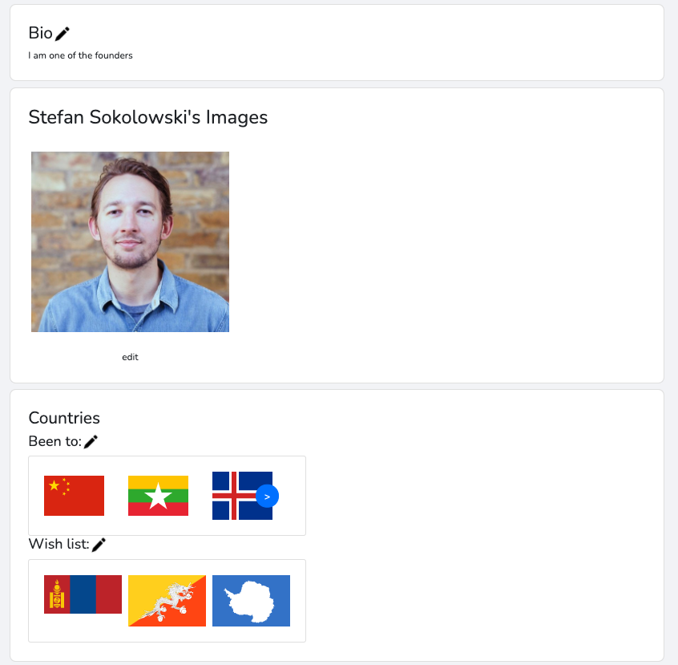

###  General Assembly, Software Engineering Immersive

# Dérive - Project 3

## Overview
Dérive brings together like-minded travellers who want to connect, explore countries and share experiences. The idea came after reflecting on my personal travelling experiences and noticing a “gap in the market”. This project was built by a group of three in one week.


[Click here to use the app.](https://derivetravelapp.herokuapp.com/)


### Project Brief
* Build a full-stack application, making your own backend and frontend
* Use an Express API to serve your data from a Mongo database
* Consume your API with a front-end built with React
* Use git to code collaboratively in a team.
* Be a complete product which most likely means multiple relationships and CRUD functionality for at least a couple of models
* Implement thoughtful user stories/wireframes that are significant enough to help you know which features are core MVP and which you can cut
* Include automated tests
* Have a visually impressive design
* Be deployed online so it's publicly accessible.


### Technologies used
<table>
	<tr>
		<td><b>Backend</b></td>
		<td><b>Frontend</b></td>
		<td><b>Other</b></td>
	</tr>
	<tr>
		<td>
			<ul>
				<li>Node.js</li>
				<li>Mongoose</li>
				<li>Express</li>
				<li>MongoDB</li>
			</ul>
		</td>
		<td>
			<ul>
				<li>HTML</li>
				<li>JavaScript</li>
				<li>SCSS</li>
				<li>React</li>
				<li>React Bootstrap</li>
				<li>React Router</li>
				<li>Webpack</li>
			</ul>
		</td>
		<td>
			<ul>
				<li>Git / GitHub</li>
				<li>Axios</li>
				<li>Mocha and Chai</li>
				<li>Bcrypt</li>
				<li>Mapbox</li>
				<li>React Hook Form</li>
				<li>Trello & InVision</li>
			</ul>
		</td>
	</tr>
</table>


## Setting the Foundations
To begin with, we built a wireframe of the app using third-party tool InVision, and used Trello to recreate a Kanban agile methodology, with user stories arranged as tickets. We implemented the MoSCow method with our Trello board to determine the features that should be included in our MVP, and to better organise our schedules. Together we would have daily stand up, discuss what needed to be completed and assign various tickets to people to complete.

### InVision


### Trello


## Backend
As a team, we decided to program the backend together so that we could all gain experience, plus reduce the amount of time spent debugging. We implemented a CRUD API using Node.js, MongoDB, Mongoose and Express.

### Model
We used a Model, View, Controller design pattern and created schemas to represent various models. Our most extensive schema, the user schema, featured registration and profile information. We used validation syntax in our schemas, for instance in combination with a regular expression to check whether a valid email address had been typed:

```
const userSchema = new mongoose.Schema({
  fullName: {
    type: String,
    required: true
  },
  email: {
    type: String,
    required: true,
    unique: true,
    validate: {
      validator: function(val){
        return /^(([^<>()\[\]\\.,;:\s@"]+(\.[^<>()\[\]\\.,;:\s@"]+)*)|(".+"))@((\[[0-9]{1,3}\.[0-9]{1,3}\.[0-9]{1,3}\.[0-9]{1,3}])|(([a-zA-Z\-0-9]+\.)+[a-zA-Z]{2,}))$/.test(val)
      },
      message: props => `${props.value} is not a valid email address.`
    } 
  },
  password: { 
    type: String, 
    required: true, 
    minlength: 6 
  },
  comments: [{ type: mongoose.Schema.Types.ObjectId, ref: 'Comment' }],
  bio: { type: String },
  nationality: { type: String },
  countriesVisited: [{ type: mongoose.Schema.Types.ObjectId, ref: 'Country' }],
  countriesWishList: [{ type: mongoose.Schema.Types.ObjectId, ref: 'Country' }],
  isTravelling: { type: Boolean },
  isPublic: { type: Boolean },
  friends: [{ type: mongoose.Schema.Types.ObjectId, ref: 'User' }],
  sentRequests: [{ type: mongoose.Schema.Types.ObjectId, ref: 'User' }],
  receivedRequests: [{ type: mongoose.Schema.Types.ObjectId, ref: 'User' }],
  languages: [{ type: mongoose.Schema.Types.ObjectId, ref: 'Language' }],
  profilePicture: { type: String },
  images: [{ type: mongoose.Schema.Types.ObjectId, ref: 'Image' }]
})
```


To make things secure we used Mongoose’s ```'mongoose-hidden``` library to omit password data from API responses, and ```mongoose-unique-validator``` with regular expressions for user email validation. Further validation was carried out using ```bcrypt``` on the model to provide an encrypted layer of security.


### Views and Controllers
Once models were defined, we created routes using Express, incorporating CRUD functionality into our backend. We used ```.populate()``` in various controllers to link the models together and return more data back in API responses. An excerpt of code below illustrates how when a request was made to get the user by an id, this would also display various other data such as the user’s comments:

```
async getUserById(req, res, next) {
    const id = req.params.id
    try {
      const user = await User.findById(id)
        .populate('comments')
        .populate('friends')
        .populate('countriesVisited')
        .populate('countriesWishList')
        .populate('receivedRequests')
        .populate('languages')
        .populate('images')
      res.status(202).send(user)
    } catch (err) {
      next(err)
    }
  },

```

We also added a ```secureRoute``` middleware into some controllers. This middleware featured the library ```jsonwebtoken``` to make sure that the user making the request existed, had a valid token, and had permission to make a request. Some functionality in the app such as posting, editing and deleting comments would require that a user had logged in successfully.


## Frontend
The majority of the project was a group effort but I took ownership of various sections such as the profile, login pages and other components.

Axios was used to get data on page load, updating profile data and forms with information. I used the ```react-hook-form``` library to programmatically create forms throughout the app using a ```FormGenerator``` component. Wherever a form was needed on a particular page in the app, form state was stored, for example in the case of the profile page:

```
const [userForm, updateUserForm] = useState({
    fullName: {
      label: 'Name',
      element: 'input',
      type: 'text',
      value: '',
      validation: {
        required: true
      }
    },
    profilePicture: {
      label: 'Profile Picture',
      element: 'file-input',
      value: '',
      validation: {
        required: false
      }
    },
    bio: {
      label: 'Bio',
      element: 'textarea',
      value: '',
      validation: {
        required: true
      }
    },
    nationality: {
      label: 'Nationality',
      element: 'input',
      type: 'text',
      value: '',
      validation: {}
    },
    languages: {
      label: 'Languages spoken',
      element: 'select',
      type: 'select',
      isMulti: true,
      value: [],
      options: [
        {
          label: 'English',
          value: 'English'
        }
      ],
      validation: {}
    },
    isTravelling: {
      label: 'Currently travelling?',
      element: 'select',
      value: false,
      options: [
        {
          label: 'Yes',
          value: true
        },
        {
          label: 'No',
          value: false
        }
      ],
      validation: {}
    },
    countriesVisited: {
      label: 'Countries you\'ve visited',
      element: 'select',
      type: 'select',
      isMulti: true,
      value: [],
      options: [],
      validation: {
        required: false
      }
    },
    countriesWishList: {
      label: 'Which countries would you like to visit?',
      element: 'select',
      type: 'select',
      isMulti: true,
      value: [],
      options: [],
      validation: {
        required: false
      }
    }
  })
```

Various profile sections were contained in ```<div>``` elements and were customisable by the user at the click of a button, calling a function ```showEditFieldModalHandler```. This function would pass the section’s id in as an argument to ```updateSelectedModal``` which would cause a modal with relevant forms to appear.


##### Example section:
```
const general = <div id={'general'}>
    <Card className='profileCard'>
      <h3>General{isEditMode && }</h3>
      <div>Nationality: {userProfileData.nationality}</div>
      <div>Currently travelling: {userProfileData.isTravelling === true ? 'Yes' : 'No'}</div>
      <div>Languages spoken: {userProfileData.languages && printLanguages()}</div>
    </Card>
  </div>
```


##### Handler:
```
const showEditFieldModalHandler = e => {
    let container = e.target
    while (!container.hasAttribute('id')) {
      container = container.parentElement
    }
    updateSelectedModal(container.id)
    updateShowModal(true)
  }

```

Modals contained ```<Form>``` components which incorporated react-hook-form functionality. Handlers were written to update the form state accordingly, and to make PUT requests with updated data using axios, thereby updating details on the database.


##### Excerpt:
```
let modalBody

switch (selectedModal) {
    case 'general':
      modalBody = <Form controls={formControls} onSelectChange={formHandlers.handleSelectChange} config={{ nationality: userForm.nationality, isTravelling: userForm.isTravelling, languages: userForm.languages }} onSubmit={formHandlers.handleSubmit} onChange={formHandlers.handleChange} />
      break

```


## Challenges
* Using React Hook Forms was difficult at first but it became easier over time and I enjoyed the streamlined feel that it gave to the app.
* Using React Bootstrap was challenging at times to use, but it was great to tackle new technologies that we had previously not relied upon.
* I ran into problems trying to code a button displaying a user’s “friend status” - we all attempted to tackle the problem together but unfortunately ran out of time.

If you have spotted any additional bugs, please let me know by [email.](mailto:stefansokolowski16@gmail.com)


## Achievements
* We planned the project well, communicating effectively and making use of version control with git to keep things organised.
* Every member of the team had a willingness to support each other.
* Making use of Agile methodologies was useful and we split tasks up in an efficient way, allowing each member to tackle the core requirements with time left over to implement extra features.
* A great sense of satisfaction working on my first full-stack project with genuine potential.
* Implementing slick styling.
* Coding a live notification feature that displayed when a user had added another.
* Implementing a series of features that worked together in harmony.


## Key learnings
* Learning about abstraction with React components.
* I learnt the value of making components as reusable and programmatic as possible.
* I gained experience through collaboration and teamwork. Together we all learnt something new every day.
* Working with a former SCRUM project manager gave me valuable insights into the coding industry and agile software development.


## Features I'd like to implement
* Using WebSocket to allow users to communicate with each other and send live messages.
* Adding further social media options such as deleting your account and blocking other users.
* Being able to present live notifications for comments, likes and more.
* We ran out of time to implement profile visibility status, i.e. whether a profile was public or private.


## The Finished Product





